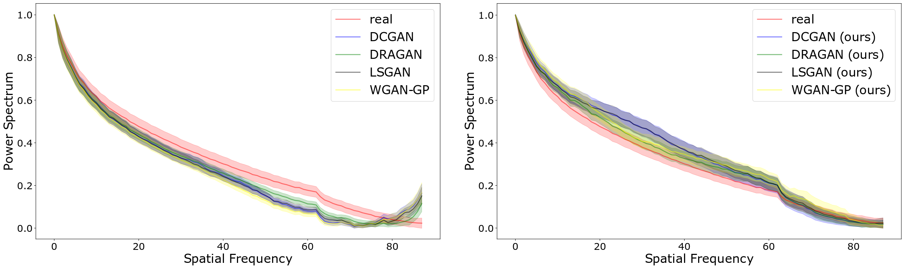
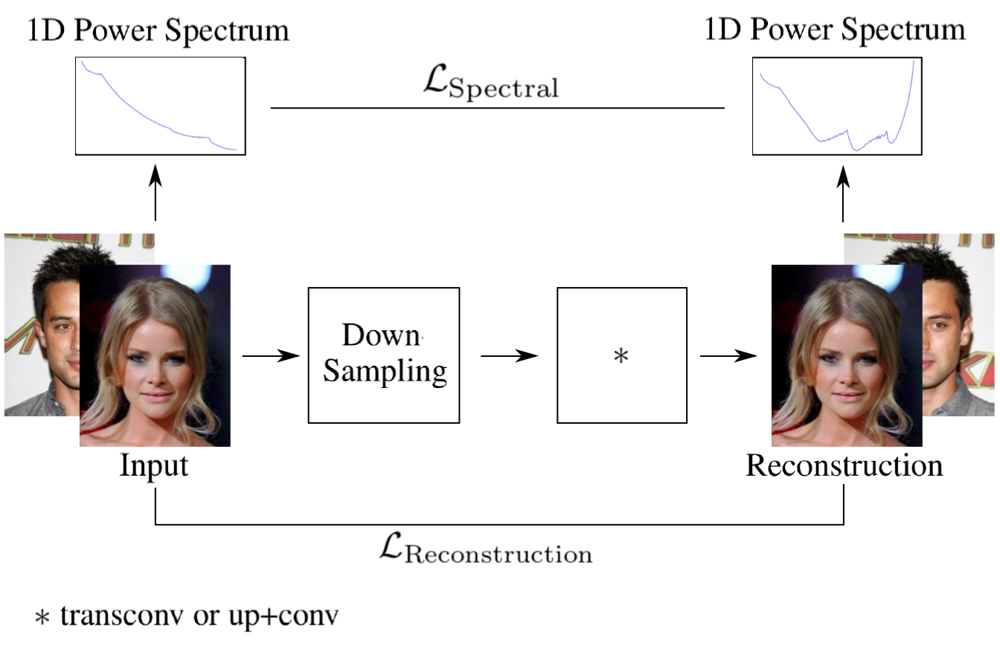
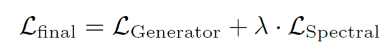

# [Watch your Up-Convolution: CNN Based Generative Deep Neural Networks are Failing to Reproduce Spectral Distributions](https://arxiv.org/abs/1911.00686)

This repository provides the official Python implementation of Watch your Up-Convolution: CNN Based Generative Deep Neural Networks are Failing to Reproduce Spectral Distributions (Paper: [https://arxiv.org/abs/1911.00686](https://arxiv.org/abs/1911.00686)).



Common up-convolution methods are inducing
heavy spectral distortions into generated images. (Left)
Statistics (mean and variance) after azimuthal
integration over the power-spectrum of real and GAN generated images. 
(Right) Results of the same experiments as above, adding
our proposed spectral loss during GAN training.

## Spectral Regularization

<p align='center'>  
    
</p>


Schematic overview of the simple auto encoder
(AE) setup used to demonstrate the effects of upconvolutions
in Figure 5, using only a standard MSE reconstruction
loss (bottom) to train the AE on real images.
We down-scale the input by a factor of two and then use the
different up-convolution methods to reconstruct the original
image size. 

## Experimental Evaluation

We evaluate the findings of the previous sections in three
different experiments, using prominent GAN architectures
on public face generation datasets.

<p align='center'>  
    
</p>


## Dependencies
Tested on Python 3.6.x.
* [Pytorch](https://pytorch.org/get-started/previous-versions/) (1.1.0)
* [NumPy](http://www.numpy.org/) (1.16.2)
* [Opencv](https://opencv.org/opencv-4-0/) (4.0.0)
* [Matplotlib](https://matplotlib.org/) (3.1.1)


###  Citation
If this work is useful for your research, please cite our [paper](https://arxiv.org/abs/1911.00686):
```
@misc{durall2019unmasking,
    title={Unmasking DeepFakes with simple Features},
    author={Ricard Durall and Margret Keuper and Franz-Josef Pfreundt and Janis Keuper},
    year={2019},
    eprint={1911.00686},
    archivePrefix={arXiv},
    primaryClass={cs.LG}
}
```
