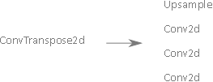

# [Watch your Up-Convolution: CNN Based Generative Deep Neural Networks are Failing to Reproduce Spectral Distributions](https://arxiv.org/abs/1911.00686)

This repository provides the official Python implementation of Watch your Up-Convolution: CNN Based Generative Deep Neural Networks are Failing to Reproduce Spectral Distributions (Paper: [https://arxiv.org/abs/1911.00686](https://arxiv.org/abs/1911.00686)).


Common up-convolution methods are inducing
heavy spectral distortions into generated images. (Left)
Statistics (mean and variance) after azimuthal
integration over the power-spectrum of real and GAN generated images. 
(Right) Results of the same experiments as above, adding
our proposed spectral loss during GAN training.


## Spectral Regularization

Since common generative network architectures are
mostly exclusively using image-space based loss functions,
it is not possible to capture and correct spectral distortions
directly. Hence, we extend existing GAN architectures in two ways:

<ul>
  <li>Spectral loss term</li>
    <p align='center'>  
    
    </p>
  <li>Replace last last up-convolution unit.</li>
    <p align='center'>  
    
    </p>
</ul>  

## Dependencies
Tested on Python 3.6.x.
* [Pytorch](https://pytorch.org/get-started/previous-versions/) (1.1.0)
* [NumPy](http://www.numpy.org/) (1.16.2)
* [Opencv](https://opencv.org/opencv-4-0/) (4.0.0)
* [Matplotlib](https://matplotlib.org/) (3.1.1)

## Downloading Dataset
To download the CelebA dataset:

Link to download [CelebA dataset](http://mmlab.ie.cuhk.edu.hk/projects/CelebA.html)

## Training Netwroks

### Training vanilla models
We train different GAN models using this [repo] (https://github.com/LynnHo/DCGAN-LSGAN-WGAN-GP-DRAGAN-Pytorch). Then, we employ our Visualization script to analyse the frequency behaviour.

### Training Spectral Regularization models
From the vanilla models, substitue train.py for train_spectrum.py and module.py for module_spectrum.py.


##  Citation
If this work is useful for your research, please cite our [paper](https://arxiv.org/abs/1911.00686):
```
@misc{durall2019unmasking,
    title={Unmasking DeepFakes with simple Features},
    author={Ricard Durall and Margret Keuper and Franz-Josef Pfreundt and Janis Keuper},
    year={2019},
    eprint={1911.00686},
    archivePrefix={arXiv},
    primaryClass={cs.LG}
}
```
